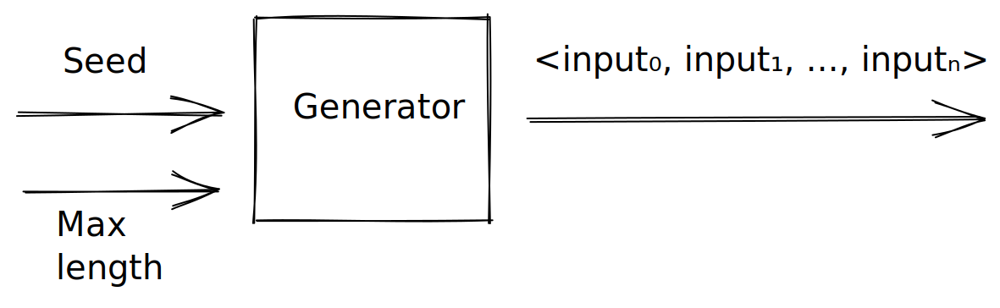
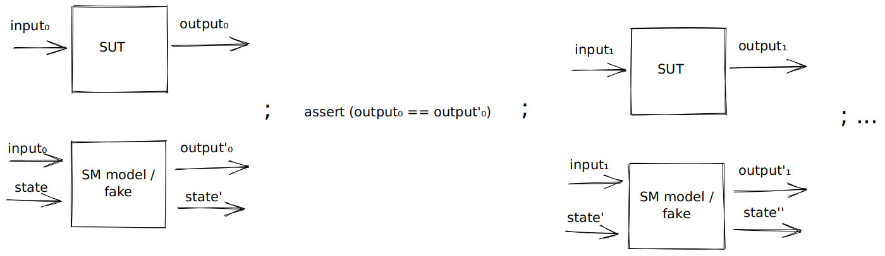
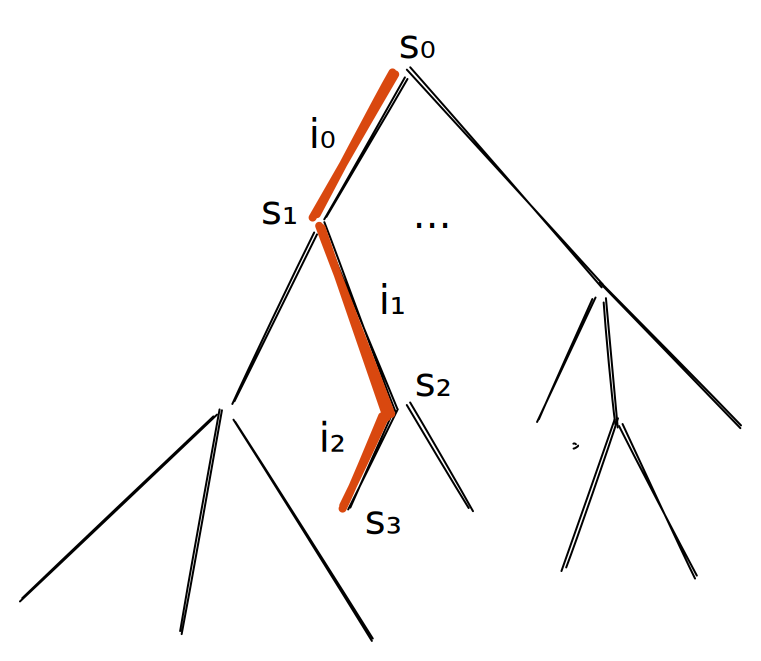
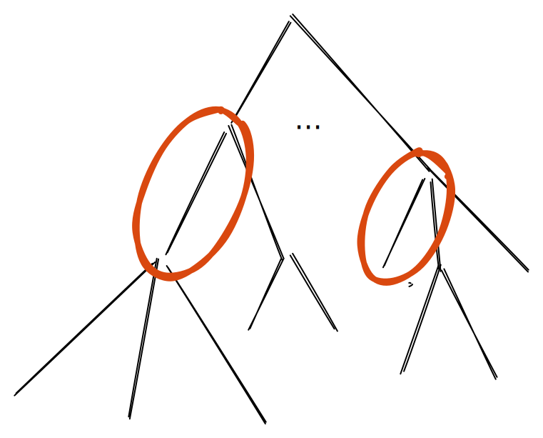

# State machine testing

## Recap: property-based testing

Before we get into how to apply property-based testing (PBT) to stateful systems, lets recall what PBT of pure programs looks like. Here are a few typical examples:

-   `forall (xs : List Int). reverse (reverse xs) == xs`
-   `forall (i : Input). deserialise (serialise i) == i`
-   `forall (xs : List Int). sort (sort xs) == sort xs`
-   `forall (i j k : Int). (i + j) + k == i + (j + k)`
-   `forall (x : Int, xs : List Int). member x (insert x xs) && not (member x (remove x xs))`

The idea is that we quantify over some inputs (left-hand side of the `.` above) which the PBT library will instantiate to random values before checking the property (right-hand side). In effect the PBT library will generate unit tests, e.g. the list `[1, 2, 3]` can be generated and reversing that list twice will give back the same list. How many unit tests are generated can be controlled via a parameter of the PBT library.

Typical properties to check for include: involution (reverse example above), inverses (serialise example), idempotency (sort example), associativity (addition example), axioms of abstract datatypes (member example) etc. Readers familiar with discrete math might also notice the structural similarity of PBT with proof by induction, in a sense: the more unit tests we generate the closer we come to approximating proof by induction (not quite true but could be a helpful analogy for now, we’ll come back to this later).

## Motivation

The nice thing about pure functions is that we can test them in isolation and compose them into bigger functions that are are still “correct”.

The same thing cannot be said for stateful programs, because features of a stateful program depend on the current state of the system and so one feature can change the state in a way that breaks another feature. With other words we often cannot test features in isolation, this is sometimes called the [feature interaction problem](https://en.wikipedia.org/wiki/Feature_interaction_problem).

Let’s have a look at the combinatorics of testing feature interaction of stateful systems:

-   *n* features and 3-4 tests per feature  ⇒ *O*(*n*) test cases
-   *n* features and testing pairs of features  ⇒ *O*(*n*<sup>2</sup>) test cases
-   *n* features and testing triples of features  ⇒ *O*(*n*<sup>3</sup>) test cases
-   Race conditions? (at least two features, non-deterministic)

The more features we have the more test cases we need, so PBT and generating test cases automatically is even more important in the stateful case.

## Plan

If one looks up the definition of “testing” in the dictionary it says:

> “the process of using or trying something to see if it works, is suitable, obeys the rules, etc.”

In order to check that the software under test (SUT) obeys the rules we must first write down the rules. In the pure setting we did this through a predicate on the output. In the stateful setting we need to account for the state somehow, we will be using a state machine specification achieve this.

Since the state machine specification is executable, i.e. it has the type `Input -> State -> (Output, State)` so we can feed it input and the current state to get an output and the next state, we effectively got a [test oracle](https://en.wikipedia.org/wiki/Test_oracle) or a [test double fake](https://en.wikipedia.org/wiki/Test_double) of the SUT.

Our testing strategy will be to generate a sequence of random inputs, then for each input run it against the real SUT and against the state machine model and see if the outputs match, and then repeat the procedure with the next input using the updated state.

## How it works

Before we dive into the code lets try to visualise how what we just described fits together.

A test case is merely a sequence of inputs to the SUT. We *generate* it using a seed and a max length parameter that bounds the length of the sequence.



Once we generated the sequence we process it one input at the time, and apply the input to both the SUT and the state machine model, and then assert that the outputs match, rinse and repeat with the updated state.



When an assertion fails, it’s useful to try to present the minimal sequence of inputs that caused the failure. This process is sometimes called *shrinking* and it works like this: start with the original sequence of inputs then form a tree where the children drops some of their parents inputs, like so:


Upon a failure we proceed depth-first through the tree, initially aggressively pruning the tree to try to find a smaller set of inputs that still produce a failure. We stop going deeper when the failure no longer happens, and present the most recently failing parent.

For example, the generated sequence `< i_0, i_1, i_2, i_3 >` fails, so first we check if `< i_0, i_1 >` fails. Lets say it doesn’t so then we are done with that branch and instead check `< i_2, i_3 >`. Lets say that does fail then we proceed trying if only `< i_2 >` or `< i_3 >` fail, if they don’t then `< i_2, i_3 >` is the counterexample we present.

If we find a sequence of inputs that causes a failure, we might want to save that test case as a *regression test*. It can be helpful to think of a regression test as a path through a (different from the shrinking) tree:



Where we got some initial state *s*<sub>0</sub>, then by applying input *i*<sub>0</sub> we get to some new state *s*<sub>1</sub> and so on. Note that this tree can be infinitely branching if the state space is infinite.

One common mistake that people make when doing PBT is to assume that the *coverage* is good, due to the randomness of test case generation.

Corner case thinking associated with good unit tests still applies, e.g. make sure we try 0, -1, maxInt, etc, but instead of writing those unit tests we ensure that those test cases get generated by monitoring the generation procedure!

We can think of coverage as making sure that certain paths appear in our tree with state in the nodes and inputs along the edges.



## SUT

<!---

> {-# LANGUAGE DerivingStrategies #-}

> module Part01SMTesting
>   ( module Part01SMTesting
>   , quickCheck
>   , withMaxSuccess
>   )
>   where

> import Control.Monad.IO.Class (MonadIO, liftIO)
> import Data.IORef (IORef, newIORef, readIORef, writeIORef)
> import Test.QuickCheck (Property, Gen, sample, quickCheck, withMaxSuccess, cover, classify,
>                         forAllShrink, shrink, shrinkList, arbitrary, oneof, listOf)
> import Test.QuickCheck.Monadic (run, monitor, monadicIO)
> import Test.HUnit (Assertion, assertBool)

-->

The software under test (SUT) of the day is a counter that can be incremented and read from. It’s implemented using a mutable reference (`IORef`) to an `Int`.

``` haskell
newtype Counter = Counter (IORef Int)
```

``` haskell
newCounter :: IO Counter
newCounter = do
  ref <- newIORef 0
  return (Counter ref)
```

``` haskell
incr :: Counter -> Int -> IO ()
incr (Counter ref) i = do
  j <- readIORef ref
  if j > 1000
  then writeIORef ref (i + j + 1)
  else writeIORef ref (i + j)
```

``` haskell
get :: Counter -> IO Int
get (Counter ref) = readIORef ref
```

## State machine model/specification/fake

The specification of our SUT is state machine model that uses a plain `Int` (unlike the real implementation it uses no mutable reference).

``` haskell
newtype FakeCounter = FakeCounter Int
  deriving stock Show
```

A state machine is a function from the current state and some input to the updated state and some output. We introduce two new types for the input and outputs:

``` haskell
data Command = Incr Int | Get
  deriving stock (Eq, Show)
```

``` haskell
data Response = Unit () | Int Int
  deriving stock (Eq, Show)
```

Next we define the initial state and the state machine function.

``` haskell
type Model = FakeCounter -- A.k.a. state
```

``` haskell
initModel :: Model
initModel = FakeCounter 0
```

``` haskell
step :: Model -> Command -> (Model, Response)
step m cmd = case cmd of
  Incr i -> Unit <$> fakeIncr m i
  Get    -> Int  <$> fakeGet m
  where
    fakeIncr :: FakeCounter -> Int -> (FakeCounter, ())
    fakeIncr (FakeCounter i) j = (FakeCounter (i + j), ())
```

``` haskell
    fakeGet :: FakeCounter -> (FakeCounter, Int)
    fakeGet (FakeCounter i) = (FakeCounter i, i)
```

## Testing library

Recall that we want generate a random program and then run it against the SUT and the state machine model and assert that the outputs match.

We want to generate random programs, so lets first define what a program is.

``` haskell
newtype Program = Program [Command]
  deriving stock Show
```

A program generator can now be defined using combinators provided by the property-based testing library.

``` haskell
genProgram :: Model -> Gen Program
genProgram _m = Program <$> listOf genCommand
```

``` haskell
genCommand :: Gen Command
genCommand = oneof [Incr <$> genInt, return Get]
```

``` haskell
genInt :: Gen Int
genInt = oneof [arbitrary]
```

We can sample our program generator to get a feel for what kind of programs it generates.

``` haskell
samplePrograms :: IO ()
samplePrograms = sample (genProgram initModel)
```

In case we generate a program for which the state machine model and SUT disagree we’d like to shrink the program before presenting it to the user in order to make it easier to see what went wrong.

``` haskell
shrinkProgram :: Program -> [Program]
shrinkProgram (Program cmds) = [ Program (merge cmds') | cmds' <- shrinkList shrinkCommand cmds ]
  where
    merge []                        = []
    merge (Incr i : Incr j : cmds') = Incr (i + j) : merge cmds'
    merge (cmd : cmds')             = cmd : merge cmds'
```

``` haskell
shrinkCommand :: Command -> [Command]
shrinkCommand (Incr i) = [ Incr i' | i' <- shrink i ]
shrinkCommand Get      = []
```

Finally we have all the pieces necessary to write our property that generates programs, runs them against the SUT and the model, and asserts that the outputs are the same.

``` haskell
prop_counter :: Property
prop_counter = forallPrograms $ \prog -> monadicIO $ do
  c <- run newCounter
  let m = initModel
  (b, hist) <- runProgram c m prog
  monitor (coverage hist)
  return b
```

``` haskell
forallPrograms :: (Program -> Property) -> Property
forallPrograms p =
  forAllShrink (genProgram initModel) shrinkProgram p
```

``` haskell
runProgram :: MonadIO m => Counter -> Model -> Program -> m (Bool, Trace)
runProgram c0 m0 (Program cmds0) = go c0 m0 [] cmds0
  where
     go _c _m hist []           = return (True, reverse hist)
     go  c  m hist (cmd : cmds) = do
       resp <- liftIO (exec c cmd)
       let (m', resp') = step m cmd
       if resp == resp'
       then go c m' (Step m cmd resp m' : hist) cmds
       else return (False, reverse hist)
```

``` haskell
exec :: Counter -> Command -> IO Response
exec c cmd = case cmd of
  Incr i -> Unit <$> incr c i
  Get    -> Int  <$> get c
```

As a byproduct of running our generated program we also produce a trace of which commands gave what responses and what the state as before and after said command was executed.

``` haskell
type Trace = [Step]
```

``` haskell
data Step = Step
  { sModelBefore :: Model
  , sCommand     :: Command
  , sResponse    :: Response
  , sModelAfter  :: Model
  }
```

Such traces are useful for many things, for example ensuring that we got good coverage.

``` haskell
coverage :: Trace -> Property -> Property
coverage hist = classifyLength hist . classifyOverflow hist
  where
    classifyLength xs = classify (length xs == 0)                      "0 length"
                      . classify (0   < length xs && length xs <= 10)  "1-10 length"
                      . classify (10  < length xs && length xs <= 50)  "11-50 length"
                      . classify (50  < length xs && length xs <= 100) "51-100 length"
                      . classify (100 < length xs && length xs <= 300) "101-300 length"
                      . classify (300 < length xs && length xs <= 500) "301-500 length"
    classifyOverflow [] = id
```

``` haskell
    classifyOverflow (Step (FakeCounter c) (Incr i) _resp _model' : hist') =
       cover 2 (isOverflow c i) "overflow" . classifyOverflow hist'
    classifyOverflow (_ : hist') = classifyOverflow hist'
```

``` haskell
    isOverflow i j = toInteger i + toInteger j > toInteger (maxBound :: Int)
```

## Regression tests

When we find a counterexample that breaks our property we can add a regression test for it by merely copy-pasting the generated program into our test suite and using the following function, which does the same thing as our property, but skips the generation step.

``` haskell
assertProgram :: String -> Program -> Assertion
assertProgram msg prog = do
  c <- newCounter
  let m = initModel
  (b, _hist) <- runProgram c m prog
  assertBool msg b
```

## Demo script

Here’s an example REPL session using the above code, to give you an idea of how it executes without having to load and run it yourself.

      > c <- newCounter
      > get c
      0
      > incr c 4
      > get c
      4

      > :t step
      step :: Model -> Command -> (Model, Response)
      > :i Command
      data Command = Incr Int | Get
      > let m = initModel
      > step m Get
      (FakeCounter 0, Int 0)
      > step m (Incr 4)
      (FakeCounter 4, Unit ())

      > sample genCommand
      Incr 0
      Incr (-1)
      Get
      Incr 2
      Get
      Get
      Incr (-9)
      Incr (-5)
      Incr (-3)
      Incr (-15)
      Get

      > sample (resize 400 genCommand)
      Incr 385
      Incr (-276)
      Incr 232
      Incr (-246)
      Get
      Get
      Incr (-392)
      Incr (-96)
      Incr (-158)
      Get
      Get

      > quickCheck prop_counter
      +++ OK, passed 100 tests:
      51% 11-50 length
      29% 1-10 length
      18% 51-100 length
       2% 0 length

      Only 0% overflow, but expected 2%

      > quickCheck (withMaxSuccess 10000 (noShrinking prop_counter))
      *** Failed! Falsified (after 498 tests):
      Program [Incr 95,Incr 51,Incr (-6),Get,Get,Get,Get,Incr (-69),Incr (-31),Get,Incr 68,Get,Get,Get,Incr 85,Get,Incr (-51),Get,Incr 77,Get,Get,Incr (-15),Get,Incr 65,Incr (-69),Get,Get,Get,Incr 54,Incr 95,Get,Incr 63,Incr 77,Get,Get,Incr 71,Incr 62,Incr (-57),Incr (-9),Get,Get,Incr (-84),Get,Incr 87,Incr (-30),Get,Get,Incr (-54),Incr 36,Get,Incr (-27),Incr 88,Get,Incr 78,Incr 62,Incr 95,Get,Incr 75,Incr 7,Incr (-24),Incr 32,Get,Incr 39,Incr 86,Incr 9,Incr (-12),Incr 97,Get,Get,Incr (-34),Incr 80,Incr 68,Get,Incr 83,Get,Get,Incr 82,Incr (-35),Incr (-25),Get,Incr 81,Incr (-71),Get,Incr 7]

      > quickCheck (withMaxSuccess 10000 prop_counter)
      *** Failed! Falsified (after 1199 tests and 22 shrinks):
      Program [Incr 1001,Get,Incr 0,Get]

## Discussion

Q: The specification is longer than the SUT!?

A: For something as simple as a counter, this is true, but for any “real world” system that e.g. persists to disk the model will likely be smaller by an order of magnitude or more.

The model can also be used for:

-   Proof-of-concepts or demos, before real implementation starts;
-   Documentation and on-boarding material (easier to understand the smaller model than the real thing);
-   Race condition testing (more on this in the next part);
-   As a test double [fake](https://www.martinfowler.com/bliki/TestDouble.html) (part 3).

## Exercises

Don’t take these too seriously, they are merely here to give you some inspiration of small stuff to play with.

0.  If you’re not comfortable with Haskell, port the above code to your favorite programming language.

    The difficulty of this will vary greatly depending on what your favorite language is, how good clone of the `QuickCheck` PBT library the language has, and how comfortable you are with understanding the above Haskell code in the first place. We’d therefore like to encourage people who have successfuly done this excerise to let us know of suitable languages and PBT libraries for this task! We’ll list them here, so that people who are unsure don’t embark on an potentially impossible task.

    As a further note of warning: some PBT libraries in some languages have an API very different from `QuickCheck`, but are still capable of writing the tests we did here. However their APIs might not be able to do concurrent testing like we will do in part 2 and later, for example Go’s [`gopter`](https://pkg.go.dev/github.com/leanovate/gopter) and [`rapid`](https://github.com/flyingmutant/rapid) libraries.

1.  Run the `prop_counter` property, perhaps using `withMaxSuccess` to adjust the number of test cases generated, in order to trigger a bug that we’ve hidden somewhere in the SUT. Fix the bug and ensure that tests pass.

2.  Notice that the coverage says 0% overflow (corner) test cases, fix generation so that overflow cases are more likely to happen.

3.  Add a `Reset` `Command` which resets the counter to its initial value.

4.  Reimplement shrinking for programs.

5.  Write a REPL for the state machine. Start with the initial state, prompt the user for a command, apply the provided command to the step function and display the response as well as the new state, rinse and repeat.

    (For a SUT as simple as a counter this doesn’t make much sense, but when the SUT get more complicated it might make sense to develop the state machine specification first, demo it using something like a REPL or some other simple UI before even starting to implement the real thing.)

6.  Add a coverage check ensures that we do a `Get` after an overflow has happened.

7.  Write a display function for `Trace` which shows how the system evolved over time, the output could for example look like this:

<!-- -->

       state0
         == command0 ==> response0
       state1
         == command1 ==> response1
       ...

8.  Collect timing information about how long each command takes to execute on average.

9.  Some systems might have inputs which generate resources which later inputs can depend on, e.g. the unix filesystem syscall `open` returns a file descriptor which can later be passed to `read` or `write`. Figure out how to model such systems (hint: see John Hughes’ course linked to below and how `Reference`s are used in the [`quickcheck-state-machine`](https://github.com/stevana/quickcheck-state-machine#readme) library).

    (Note that adding this feature makes state machine testing more complicated, because generation, shrinking and execution needs to account for these resources. That’s why we left them out.)

## See also

In case your are interested in finding out more, here are some resources. They are sorted in increasing level of difficulty.

-   For more on how feature interaction gives rise to bugs see the following [blog post](https://www.hillelwayne.com/post/feature-interaction/) by Hillel Wayne summarising [Pamela Zave](https://en.wikipedia.org/wiki/Pamela_Zave)’s work on the topic;

-   The original QuickCheck [paper](https://dl.acm.org/doi/pdf/10.1145/357766.351266) by Koen Claessen and John Hughes (2000) that introduced property-based testing in Haskell;

-   John Hughes’ Midlands Graduate School 2019 [course](http://www.cse.chalmers.se/~rjmh/MGS2019/) on property-based testing, which covers the basics of state machine modelling and testing. It also contains a minimal implementation of a state machine testing library built on top of Haskell’s QuickCheck;

-   John Hughes’ *Testing the Hard Stuff and Staying Sane* [talk](https://www.youtube.com/watch?v=zi0rHwfiX1Q) (2013-2014) stresses the importance of thinking about unit-test edge cases and ensuring they are covered by the generators when doing property-based testing;

-   Leslie Lamport’s *Computation and State Machines* [paper](https://www.microsoft.com/en-us/research/publication/computation-state-machines/) (2008) presents an argument from a mathematical point of view why state machines are central to program correctness;

-   “Can one generalize Turing machines so that any algorithm, never mind how abstract, can be modeled by a generalized machine very closely and faithfully?”

    Perhaps somewhat surprisingly it turns out that the answer is yes, and the generalisation is a state machine! (This means that in some sense the state machine is the ultimate model?!)

    For details see Gurevich’s [generalisation](http://delta-apache-vm.cs.tau.ac.il/~nachumd/models/gurevich.pdf) of the Church-Turing thesis.

## Summary

Property-based testing lets us *generate unit tests* for pure functions/components, property-based testing using state machine models lets us generate unit tests for *stateful* functions/components.

Given the feature interaction problem PBT are arguably even more important in the stateful than in the pure setting.

Even though we generate unit tests it’s still important to think like as if one is writing good unit tests, i.e. consider the corner cases and ensure they are part of the generated test cases.

## Next up

In [part 2](./Part02ConcurrentSMTesting.md#readme) we will reuse the same counter state machine model, but test the implementation concurrently in order to try to find race conditions.
