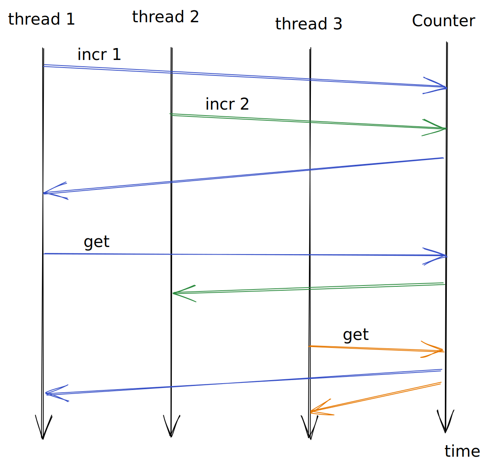
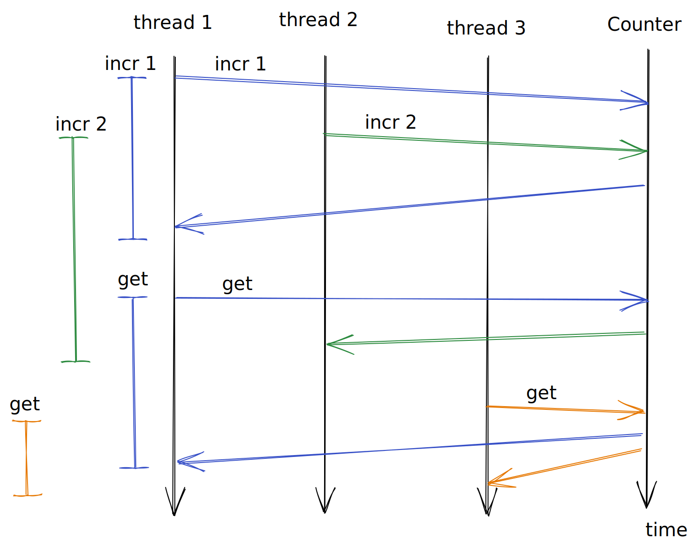
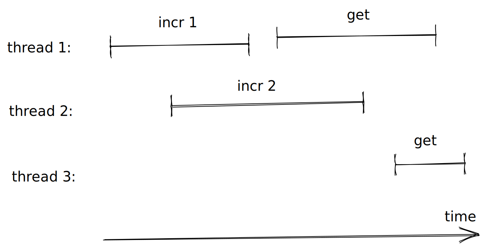
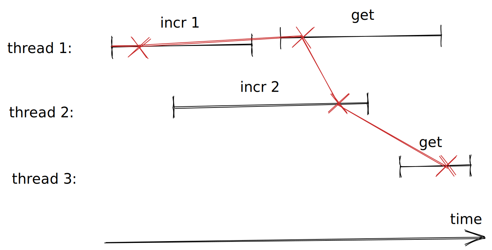
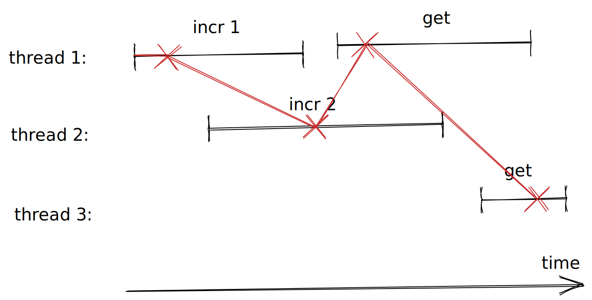

# Concurrent state machine testing with linearisability

## Motivation

In the [previous part](./Part01SMTesting.md#readme) we saw how to test if a sequential (single-threaded) program respects some state machine specification.

We did so by generating a random sequence of commands and then applied them one by one to both the real software under test (SUT), a counter, and the state machine specification and then compared the outputs.

Counters are often shared among different threads though, for example to keep track of some metric like current number of concurrent connections that our service is serving.

So we might want to ask ourselves: how can we test that the counter implementation is thread-safe?

Below we will show how the *same* state machine specification that we already developed previously can be used to check if a concurrent execution is correct using a technique called linearisability checking.

## Plan

More concretely, we’ll reuse both the counter SUT and model from previous part.

However instead of generating a sequential program (a list of commands), we’ll generate concurrent programs by generating lists of lists of commands where the inner lists represents commands that should be executed concurrently.

We’ll use several threads to execute those concurrent program and collect a concurrent history of when each command started and finished executing on each thread.

Linearisability checking is essentially a way to try to find a sequential path through the concurrent history that respects our sequential model, if we do we know that the concurrent execution is correct.

## How it works

Let’s first recall our counter example from last time:

``` haskell
 > c <- newCounter
 > incr c 1
 > incr c 2
 > get c
 3
```

When we interact with the counter sequentially, i.e. one command at the time, then it appears to count correctly.

But if we instead concurrently issue the `incr`ements , we see something strange:

``` haskell
 > forM_ [0..100000] $ \i -> do
 >   c <- newCounter
 >   concurrently_ (incr c 1) (incr c 2)
 >   x <- get c
 >   if x == 3 then return () else error ("i = " ++ show i ++ ", x = " ++ show x)
 *** Exception: i = 29768, x = 1
```

After 29768 iterations we get back `1` rather than the expected `3`! The reason for this is because there’s a race condition in the implementation of `incr`:

``` haskell
 incr (Counter ref) i = do
   j <- readIORef ref
   writeIORef ref (i + j)
```

Because we first read the old value and *then* write the new incremented value in an non-atomic way, it’s possilbe that if two threads do this at the same time they overwrite each others increment. For example:

       thread 1, incr 1         |  thread 2, incr 2
       -------------------------+------------------
        0 <- readIORef ref      |
                                | 0 <- readIORef ref
                                | writeIORef ref (2 + 0)
        writeIORef ref (1 + 0)  |
                                |
                                v
                               time

If we read from the counter after the two increments are done we get `1` instead of the expected `3`. The fix to this problem is to do an atomic update using `atomicModifyIORef'`, instead of first reading and then writing to the `IORef`.

The concurrent test that we just wrote is not only specific to the counter example but also only uses three fixed commands, the two concurrent `incr`ements followed by a `get`. While it was enough to find this race condition, in general we’d like to try arbitrary combinations of commands and possibly involving more than two threads.

The key concept we need in order to accomplish that is that of *concurrent history*, which is perhaps easiest to explain in terms of a more familiar concept: a sequence diagram.

Consider the following sequence diagram:



Here we see that the first and second thread concurrently increment, the first thread then reads the counter concurrently with the second thread’s increment that’s still going on. The second thread’s increment finishes and a third thread does a read which is concurrent with the first thread’s read.

We can abstract away the arrows and merely focus on the intervals of the commands:



If we rotate the intervals we get the concurrent history:



Note that the execution of some commands overlap in time, this is what’s meant by concurrent and arguebly it’s easier to see the overlap here than in the original sequence diagram.

We’ve also abstracted away the counter, it’s a black box from the perspective of the threads. The only thing we know for sure is when we invoked the operation and when it returned, which is what our interval captures. We also know that the effect of the operation must have happend sometime within that interval.

One such concurrent history can have different interleavings, depending on when exactly the effect of the commands happen. Here are two possible interleavings, where the red cross symbolises when the effect happened (i.e. when exactly the counter update its state).

The first corresponds to the sequential history `< incr 1, get, incr 2, get >`:



and the other interleaving corresponds to the sequential history `< incr 1, incr 2, get, get >`:



One last thing we’ve left out from the concurrent history so far is the responses. In this example, the only interesting responses are those of the `get`s.

Let’s say that the `get`s returned `1` and `3` respectively. Is this a correct concurrent outcome? Yes, according to linearisability it’s enough to find a single interleaving for which the sequential state machine model can explain the outcome and in this case the first interleaving above `< incr 1, get, incr 2, get >` does that.

What if the `get`s both returned `3`? That’s also correct and witnessed by the second interleaving `< incr 1, incr 2, get, get >`. When we can find a sequential interleaving that supports the outcome of a concurrent execution we say that the concurrent history linearises.

If the `get` on the third thread returned `1` or `2` however, then it would be a non-linearisable outcome. We can see visually that that `get` happens after both `incr`, so no matter where we choose to place the red crosses on the `incr`s the effects will happen before that `get` so it must return `3`. Is it even possilbe that `1` or `2` are returned? It’s, imagine if `incr` is implemented by first reading the current value then storing the incremented value, in that case there can be a race where the `incr`s overwrite each other.

So to summarise, we execute commands concurrently using several threads and gather a concurrent history of the execution. We then try to find a sequential interleaving (a choice of where the red crosses in the diagrams should be) which respects the a sequential state machine model specfication. If we find a single one that does, then we say that the history linearises and that the concurrent execution is correct, if we cannot find a sequential interleaving that respects the model then the history doesn’t linearise and we have found a problem.

## Code

Next let us develop the code that does the concurrent execution, history collection and linearisability checking.

<!---

> {-# LANGUAGE DeriveFunctor #-}
> {-# LANGUAGE ScopedTypeVariables #-}
> {-# LANGUAGE DeriveFoldable #-}
> {-# LANGUAGE DerivingStrategies #-}

> module Part02ConcurrentSMTesting
>   ( module Part02ConcurrentSMTesting
>   , sample
>   , quickCheck
>   ) where

> import Control.Concurrent (ThreadId, threadDelay, myThreadId)
> import Control.Concurrent.Async (mapConcurrently)
> import Control.Concurrent.STM (TQueue, flushTQueue, atomically, newTQueueIO, writeTQueue)
> import Control.Monad (replicateM_, unless)
> import Data.IORef (atomicModifyIORef')
> import Data.List (permutations)
> import Data.Tree (Forest, Tree(Node), drawForest)
> import System.Random (randomRIO)
> import Test.QuickCheck (Property, Gen, classify, shrinkList, tabulate, counterexample,
>                         mapSize, sized, forAllShrinkShow, suchThat, vectorOf, chooseInt,
>                         sample, quickCheck)
> import Test.QuickCheck.Monadic (PropertyM, run, assert, monitor, monadicIO)
> import Test.HUnit (Assertion, assertBool)

-->

We will reuse the counter SUT and model from the previous part.

``` haskell
import Part01SMTesting (Counter(Counter), Model, Command(Get, Incr), Response(Int, Unit),
                       initModel, get,  step, newCounter, exec, shrinkCommand, genCommand)
```

In order to do concurrent testing we need to generate concurrent programs though. In the sequential case a program was merely a list of commands, in the concurrent case a program is a list of lists of commands, where the inner list is what is supposed to be done concurrently.

``` haskell
newtype ConcProgram = ConcProgram { unConcProgram :: [[Command]] }
  deriving stock Show
```

``` haskell
forAllConcProgram :: (ConcProgram -> Property) -> Property
forAllConcProgram k =
  forAllShrinkShow (genConcProgram m) (shrinkConcProgram m) prettyConcProgram k
  where
    m = initModel
```

When generating concurrent programs we proceed in concurrent “chunks”, each chunk is between 2 and 5 commands and each command will be executed concurrently in a separate thread. In order for a command to be valid in a chunk it needs to be safe to execute said command independent of the order in which the rest of the commands are executed.

For a simple counter all commands are trivially safe, but imagine if we were working with for example filesystem commands then it might be unsafe to remove and rename a file in the same chunk.

When we are done generating a chunk, we advance the model by all commands in that chunk before we continue generating the next one.

``` haskell
genConcProgram :: Model -> Gen ConcProgram
genConcProgram m0 = sized (go m0 [])
  where
    go :: Model -> [[Command]] -> Int -> Gen ConcProgram
    go m acc sz | sz <= 0   = return (ConcProgram (reverse acc))
                | otherwise = do
                    n <- chooseInt (2, 5)
                    cmds <- vectorOf n genCommand `suchThat` concSafe m
                    go (advanceModel m cmds) (cmds : acc) (sz - n)
```

``` haskell
advanceModel :: Model -> [Command] -> Model
advanceModel m cmds = foldl (\ih cmd -> fst (step ih cmd)) m cmds
```

``` haskell
concSafe :: Model -> [Command] -> Bool
concSafe m = all (validProgram m) . permutations
```

``` haskell
validProgram :: Model -> [Command] -> Bool
validProgram _model _cmds = True
```

``` haskell
validConcProgram :: Model -> ConcProgram -> Bool
validConcProgram m0 (ConcProgram cmdss0) = go m0 True cmdss0
  where
    go :: Model -> Bool -> [[Command]] -> Bool
    go _m False _              = False
    go _m acc   []             = acc
    go m _acc   (cmds : cmdss) = go (advanceModel m cmds) (concSafe m cmds) cmdss
```

Shrinking concurrent programs is a bit more involved then below if we want to get nice minimal counterexamples, we’ll get back to this in one of the exercises.

``` haskell
shrinkConcProgram :: Model -> ConcProgram -> [ConcProgram]
shrinkConcProgram m
  = filter (validConcProgram m)
  . map ConcProgram
  . filter (not . null)
  . shrinkList (shrinkList shrinkCommand)
  . unConcProgram
```

``` haskell
prettyConcProgram :: ConcProgram -> String
prettyConcProgram = show
```

We cannot (easily) check for correctness while we are executing a concurrent program, instead we merely collect a concurrent history while executing and check this history after execution is done.

A history contains a chronologically ordered sequence of events of when a command was invoked and on what thread or process id, and when the command finished again together with which thread or process id. A single thread or process id may only be invoking a single command at the time.

``` haskell
newtype History' cmd resp = History [Operation' cmd resp]
  deriving stock (Show, Functor, Foldable)
```

``` haskell
type History = History' Command Response
```

``` haskell
newtype Pid = Pid Int
  deriving stock (Eq, Ord, Show)
```

``` haskell
data Operation' cmd resp
  = Invoke Pid cmd
  | Ok     Pid resp
  deriving stock (Show, Functor, Foldable)
```

``` haskell
type Operation = Operation' Command Response
```

``` haskell
toPid :: ThreadId -> Pid
toPid tid = Pid (read (drop (length ("ThreadId " :: String)) (show tid)))
```

``` haskell
appendHistory :: TQueue (Operation' cmd resp) -> Operation' cmd resp -> IO ()
appendHistory hist op = atomically (writeTQueue hist op)
```

When executing, the threads involved in the execution have a shared/concurrent queue which they append their invocation and completions to. From the concurrent queue we get our concurrent history.

``` haskell
concExec :: TQueue Operation -> Counter -> Command -> IO ()
concExec queue counter cmd = do
  pid <- toPid <$> myThreadId
  appendHistory queue (Invoke pid cmd)
  -- Adds some entropy to the possible interleavings.
  sleep <- randomRIO (0, 5)
  threadDelay sleep
  resp <- exec counter cmd -- threadSafeExec counter cmd -- NOTE: Fix the race condition by uncommenting.
  atomically (writeTQueue queue (Ok pid resp))
```

``` haskell
threadSafeExec :: Counter -> Command -> IO Response
threadSafeExec c cmd = case cmd of
  Incr i -> Unit <$> threadSafeIncr c i
  Get    -> Int  <$> get c
  where
    threadSafeIncr (Counter ref) i = atomicModifyIORef' ref (\j -> (i + j, ()))
```

With a concurrent history we can generate all possible single-threaded executions.

``` haskell
interleavings :: History' cmd resp -> Forest (cmd, resp)
interleavings (History [])  = []
interleavings (History ops0) =
  [ Node (cmd, resp) (interleavings (History ops'))
  | (tid, cmd)   <- takeInvocations ops0
  , (resp, ops') <- findResponse tid
                      (filter1 (not . matchInvocation tid) ops0)
  ]
  where
    takeInvocations :: [Operation' cmd resp] -> [(Pid, cmd)]
    takeInvocations []                         = []
    takeInvocations ((Invoke pid cmd)   : ops) = (pid, cmd) : takeInvocations ops
    takeInvocations ((Ok    _pid _resp) : _)   = []
```

``` haskell
    findResponse :: Pid -> [Operation' cmd resp] -> [(resp, [Operation' cmd resp])]
    findResponse _pid []                                   = []
    findResponse  pid ((Ok pid' resp) : ops) | pid == pid' = [(resp, ops)]
    findResponse  pid (op             : ops)               =
      [ (resp, op : ops') | (resp, ops') <- findResponse pid ops ]
```

``` haskell
    matchInvocation :: Pid -> Operation' cmd resp -> Bool
    matchInvocation pid (Invoke pid' _cmd) = pid == pid'
    matchInvocation _   _                  = False
```

``` haskell
    filter1 :: (a -> Bool) -> [a] -> [a]
    filter1 _ []                   = []
    filter1 p (x : xs) | p x       = x : filter1 p xs
                       | otherwise = xs
```

If any one of the single-threaded executions respects the state machine model, then the concurrent execution is correct. This correctness criteria is the main result from the “linearizability” paper linked to below.

``` haskell
linearisable :: forall model cmd resp. Eq resp
             => (model -> cmd -> (model, resp)) -> model -> Forest (cmd, resp) -> Bool
linearisable step0 model0 = any' (go model0)
  where
    go :: model -> Tree (cmd, resp) -> Bool
    go model (Node (cmd, resp) ts) =
      let
        (model', resp') = step0 model cmd
      in
        resp == resp' && any' (go model') ts
```

``` haskell
    any' :: (a -> Bool) -> [a] -> Bool
    any' _p [] = True
    any'  p xs = any p xs
```

We now have all the pieces necessary to implement our concurrent property.

Note that in order to avoid being unlucky with the execution interleavings we actually execute the same generated test case ten times.

``` haskell
prop_concurrent :: Property
prop_concurrent = mapSize (min 20) $
  forAllConcProgram $ \(ConcProgram cmdss) -> monadicIO $ do
    monitor (classifyCommandsLength (concat cmdss))
    -- Rerun a couple of times, to avoid being lucky with the interleavings.
    monitor (tabulate "Commands" (map constructorString (concat cmdss)))
    monitor (tabulate "Number of concurrent commands" (map (show . length) cmdss))
    replicateM_ 10 $ do
      counter <- run newCounter
      queue <- run newTQueueIO
      run (mapM_ (mapConcurrently (concExec queue counter)) cmdss)
      hist <- History <$> run (atomically (flushTQueue queue))
      assertWithFail (linearisable step initModel (interleavings hist)) (prettyHistory hist)
  where
    constructorString :: Command -> String
    constructorString Incr {} = "Incr"
    constructorString Get  {} = "Get"
```

``` haskell
assertWithFail :: Monad m => Bool -> String -> PropertyM m ()
assertWithFail condition msg = do
  unless condition $
    monitor (counterexample ("Failed: " ++ msg))
  assert condition
```

``` haskell
classifyCommandsLength :: [cmd] -> Property -> Property
classifyCommandsLength cmds
  = classify (length cmds == 0)                        "length commands: 0"
  . classify (0   < length cmds && length cmds <= 10)  "length commands: 1-10"
  . classify (10  < length cmds && length cmds <= 50)  "length commands: 11-50"
  . classify (50  < length cmds && length cmds <= 100) "length commands: 51-100"
  . classify (100 < length cmds && length cmds <= 200) "length commands: 101-200"
  . classify (200 < length cmds && length cmds <= 500) "length commands: 201-500"
  . classify (500 < length cmds)                       "length commands: >501"
```

``` haskell
prettyHistory :: (Show cmd, Show resp) => History' cmd resp -> String
prettyHistory = show
```

``` haskell
displayInterleavings :: (Show cmd, Show resp) => History' cmd resp -> IO ()
displayInterleavings = putStrLn . drawForest . fmap (fmap show) . interleavings
```

## Regression testing

When we find a bug we might want to add a regression test to ensure that we don’t accidently reintroduce the same bug later on. In the concurrent case we got two options, we can turn the history into a regression test.

``` haskell
assertHistory :: History -> Assertion
assertHistory hist =
  assertBool (prettyHistory hist) (linearisable step initModel (interleavings hist))
```

Or we can save the test case itself.

``` haskell
assertConcProgram :: String -> ConcProgram -> Assertion
assertConcProgram _msg _prog = error "exercise"
```

The history approach is faster and deterministic, but if the semantics of the SUT changes so that it doesn’t produce the same history anymore then regression tests using this approach can become stale.

Saving the concurrent test case is slower, because we need to re-execute the test case, and it’s also not deterministic, since we might not trigger the same interleaving ever time we run the test. However this approach is more robust to change.

## Demo script

Here’s an example REPL session using the above code, to give you an idea of how it executes without having to load and run it yourself.

      > sample (genConcProgram initModel)
      ConcProgram []
      ConcProgram [[Incr 2,Incr 2,Get,Incr 0,Get]]
      ConcProgram [[Incr 3,Get,Incr 1,Incr 0]]
      ConcProgram [[Incr (-1),Get],[Get,Get],[Get,Get]]
      ConcProgram [[Get,Get,Incr 2,Get],[Get,Get,Incr (-5),Incr 8,Get]]
      ConcProgram [[Incr (-5),Incr (-1),Incr 7,Get],[Incr 3,Get,Get],[Get,Incr 5,Incr 0,Get,Incr 6]]
      ConcProgram [[Get,Get,Get,Get,Get],[Get,Get,Incr (-3),Incr 5],[Incr (-11),Incr (-6),Incr (-2)]]
      ConcProgram [[Incr 13,Get,Incr (-9)],[Incr (-13),Incr (-5),Incr (-4),Get],[Get,Incr 12,Incr 1,Incr 2,Get],[Incr (-10),Incr 10,Incr 11]]
      ConcProgram [[Get,Get,Get,Incr 4],[Get,Incr (-16),Get,Incr (-5)],[Incr (-9),Get,Incr (-10),Get,Incr 13],[Incr 11,Get,Get,Get]]
      ...

      > quickCheck prop_concurrent
      ConcProgram [[Incr 0,Incr 14],[Get,Get,Get]]

      Failed: History [Invoke (Pid 296705) (Incr 0),Invoke (Pid 296707) (Incr 14),Ok (Pid 296707) (Unit ()),Ok (Pid 296705) (Unit ()),Invoke (Pid 296709) Get,Invoke (Pid 296711) Get,Ok (Pid 296709) (Int 0),Invoke (Pid 296713) Get,Ok (Pid 296711) (Int 0),Ok (Pid 296713) (Int 0)]

      -- We can manually pretty print the above as:
      Pid 296705: |---- Incr 0 -------|
      Pid 296707:   |--- Incr 14 ---|
      Pid 296709:                       |--- Get => 0 ---|
      Pid 296711:                         |---- Get => 0----------|
      Pid 296713:                                          |---- Get => 0 ---|

      > displayInterleavings (History [Invoke (Pid 296705) (Incr 0),Invoke (Pid 296707) (Incr 14),Ok (Pid 296707) (Unit ()),Ok (Pid 296705) (Unit ()),Invoke (Pid 296709) Get,Invoke (Pid 296711) Get,Ok (Pid 296709) (Int 0),Invoke (Pid 296713) Get,Ok (Pid 296711) (Int 0),Ok (Pid 296713) (Int 0)])

    (Incr 0,Unit ())
    |
    `- (Incr 14,Unit ())
       |
       +- (Get,Int 0)
       |  |
       |  +- (Get,Int 0)
       |  |  |
       |  |  `- (Get,Int 0)
       |  |
       |  `- (Get,Int 0)
       |     |
       |     `- (Get,Int 0)
       |
       `- (Get,Int 0)
          |
          `- (Get,Int 0)
             |
             `- (Get,Int 0)

    (Incr 14,Unit ())
    |
    `- (Incr 0,Unit ())
       |
       +- (Get,Int 0)
       |  |
       |  +- (Get,Int 0)
       |  |  |
       |  |  `- (Get,Int 0)
       |  |
       |  `- (Get,Int 0)
       |     |
       |     `- (Get,Int 0)
       |
       `- (Get,Int 0)
          |
          `- (Get,Int 0)
             |
             `- (Get,Int 0)

## Discussion

-   Black- vs white-box testing: if you think of the SUT as a box, then checking for race conditions using linearisability requires no insight or changes to what is going on in the box, i.e. it’s a black-box technique. On the other hand, if one is ready to give access to or make changes to the box to facilitate testing then we may apply so called white-box techniques. An example of a white-box technique is Go’s [race detector](https://go.dev/blog/race-detector) or the Haskell library [dejafu](https://hackage.haskell.org/package/dejafu).

-   Why are we checking linearisability rather than some other [consistency model](https://jepsen.io/consistency)? The real answer here is, we merely followed what Jepsen’s [`knossos`](https://github.com/jepsen-io/knossos) checker does.

    Why does `knossos` use linearisability? Not sure, but some hints might be in the original paper on linearisability (linked to below under “see also”):

    ``` haskell
    "Perhaps the major practical distinction between serializability and
    linearizability is that the two notions are appropriate for different problem
    domains. Serializability is appropriate for systems such as databases in which
    it must be easy for application programmers to preserve complex
    application-specific invariants spanning multiple objects. A general-purpose
    serialization protocol, such as two-phase locking, enables programmers to reason
    about transactions as if they were sequential programs (setting aside questions
    of deadlock or performance). Linearizability, by contrast, is intended for
    applications such as multiprocessor operating systems in which concurrency is of
    primary interest, and where programmers are willing to apply special-purpose
    synchronization protocols, and to reason explicitly about the effects of
    concurrency."
    ```

    Perhaps linearisable is simply more suitable in general when testing concurrent/multiprocessor systems than serialisability (and weaker models)?

    Linearisability is also a local property:

    ``` haskell
    "Locality is important because it allows concurrent systems to be designed and
    constructed in a modular fashion; linearizable objects can be implemented,
    verified, and executed independently. A concurrent system based on a nonlocal
    correctness property must either rely on a centralized scheduler for all
    objects, or else satisfy additional constraints placed on objects to ensure that
    they follow compatible scheduling protocols. Locality should not be taken for
    granted; as discussed below, the literature includes proposals for alternative
    correctness "
    ```

    Unlike Lamport’s sequential consistency, which isn’t local (see paper for details).

    Also:

    ``` haskell
    "In conclusion, linearizability provides benefits for specifying,
    implementing, and verifying concurrent objects in multiprocessor systems.
    Rather than introducing complex new formalisms to reason directly about
    concurrent computations, we feel it is more effective to transform problems
    in the concurrent domain into simpler problems in the sequential domain."
    ```

    which we have seen in terms of being able to reuse the sequential state machine model!

-   Linearisability is by no means an intuitive concept, it will take a while before it sinks in. Meanwhile, feel free to ask questions.

## Exercises

0.  Consider a FIFO queue with the commands `E(x)` and `D => x` for enqueue `x` and dequeue `x`, which of the following histories linearise?

    1.          thread 1: |--- E(x) -----|                 |-- D => y ---|
                thread 2:   |-- E(y) --|   |--- D => x --|

    2.          thread 1: |-- E(x) --|           |--- D => y --|
                thread 2:               |-- E(y) --|

    3.          thread 1: |--- E(x) --|        |--- D => y --|
                thread 2:    |--- E(y) --|
                thread 3:                           | -- D => y --|

1.  Implement regression testing using concurrent programs.

2.  Can you figure out ways to improve the shrinking? (Hint: see parallel shrinking in [`quickcheck-state-machine`](https://hackage.haskell.org/package/quickcheck-state-machine).)

3.  How can you test that the shrinking is good/optimal? (Hint: see how `labelledExamples` is used in the [*An in-depth look at quickcheck-state-machine*](https://www.well-typed.com/blog/2019/01/qsm-in-depth/) blog post by Edsko de Vries and [*Building on developers’ intuitions to create effective property-based tests*](https://www.youtube.com/watch?v=NcJOiQlzlXQ) talk by John Hughes)

4.  Display counterexample in a way that makes it easier to see what went wrong. (Hint: perhaps taking inspiration from the diagrams in the beginning of this part.)

5.  List other techniques you know which can help with finding race conditions.

6.  What are the pros and cons of black- and white-box techniques?

7.  Implement a checker an other consistency model (hint: see what Jepsen’s other checkers do).

## See also

-   [*Finding Race Conditions in Erlang with QuickCheck and PULSE*](http://www.cse.chalmers.se/~nicsma/papers/finding-race-conditions.pdf) (2009) ([video](https://vimeo.com/6638041)) – this paper describes how Erlang’s (closed source) version QuickCheck does concurrent testing (it was the first property-based testing library to do so);

-   [*Linearizability: a correctness condition for concurrent objects*](https://cs.brown.edu/~mph/HerlihyW90/p463-herlihy.pdf) (1990), this is a classic paper that describes the main technique of the concurrent property;

-   Kyle “aphyr” Kingsbury’s blogposts about Jepsen, which also uses linearisability, and has found [bugs](http://jepsen.io/analyses) in many distributed systems:

    -   [Knossos: Redis and linearizability](https://aphyr.com/posts/309-knossos-redis-and-linearizability);

    -   [Strong consistency models](https://aphyr.com/posts/313-strong-consistency-models);

    -   [Computational techniques in Knossos](https://aphyr.com/posts/314-computational-techniques-in-knossos);

    -   [Serializability, linearizability, and locality](https://aphyr.com/posts/333-serializability-linearizability-and-locality).

## Summary

When you got a state machine model of a program, you can get race conditions testing for free via linearisability.

It’s enough to find a single sequential interleaving through a concurrent history that respects the sequential state machine model for the concurrent execution to be correct with respect to linearisability.

## Next up

In [part 3](./Part03SMContractTesting.md#readme) we will look at how we can turn state machine models into [fakes](https://martinfowler.com/articles/mocksArentStubs.html) which can be used for fast and deterministic integration testing. The fakes are [contract tested](https://martinfowler.com/bliki/ContractTest.html) using the technique from this part, to ensure that they are faithful to the real implementation.
