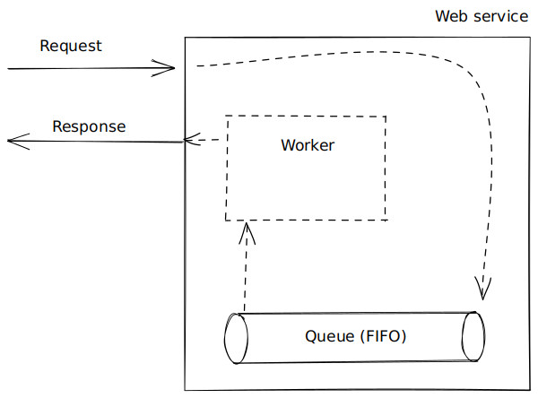
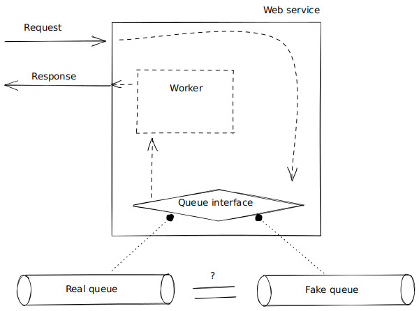
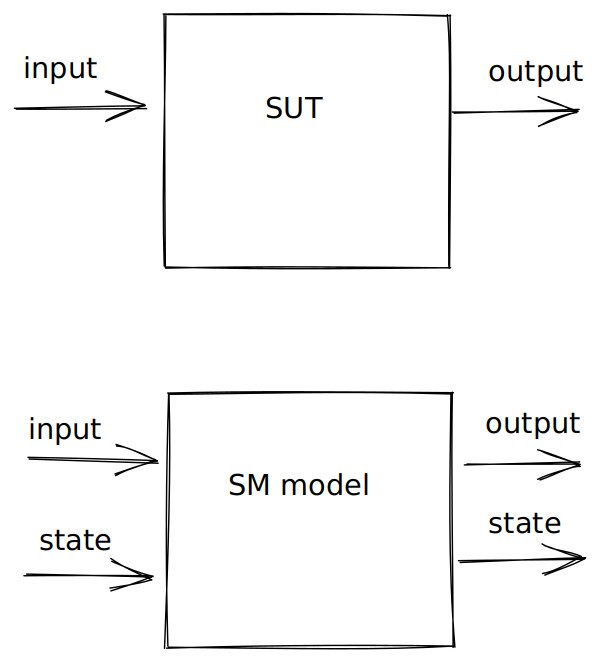
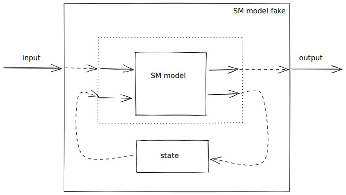

# Integration tests against state machine fakes and consumer-driven contract tests for the fakes

## Motivation

So far we have seen how to test a single component sequentially ([part 1](./Part01SMTesting.md#readme)) and concurrently ([part 2](./Part02ConcurrentSMTesting.md#readme)). Most systems are composed of several components however, and the global correctness of the composed system doesn’t follow from the local correctness of its components, a typical problem being that the two components that are meant to talk to each other make wrong assumptions about each other’s API.

The usual solution to this problem is to add so called integration tests which deploy both components and perform some kind of interaction that exercises the API between the components to ensure that the assumptions are correct. Whenever some component needs to be deployed it will slow down the test and most likely introduce some flakiness related to deployment, e.g. some port is in use already, or not yet available to be used, or docker registry is temporarily down, or some other http request that is involved during deployment fails, etc.

In order to avoid having slow and flaky integration tests, the standard solution is to mock out all the dependencies of the software under test (SUT). This works, however it introduces a new problem: what if the mocks are incorrect (i.e. they encode the same false assumptions of the consumed API). A solution to this problem is to write so called (consumer-driven) contract tests which verify that the mock is faithful to the real component. Unfortunately this solution doesn’t seem to be standard in our industry. Mocks are fairly common, but contract tests not so much so. This has led to mocks sometimes being called useless, because people have been bitten by mocks being wrong (because they didn’t have contract tests).

In our case, since we got an executable state machine model, we effectively already got something that is better than a mock: a fake. Furthermore we have already seen how to ensure that such a state machine model is faithful to the real component, i.e. we already know how to do contract tests. So in this part we will merely make these things more explicit and glue them together to get fast and deterministic integration tests.

## Plan

Imagine our system consists of two components: *A* and *B*, where *A* depends on *B*. We then proceed as follows:

1.  Following the pattern from part 1 and 2: make a state machine (SM) model of the dependency *B*, use SM testing to ensure that the model is faithful to the real implementation of *B* (these tests are our contract tests);

2.  Turn the SM model of *B* into a fake and use it in-place of the real implementation of *B* inside the real implementation of *A*;

3.  Repeat the first step for component *A*. Note that while testing *A* we will not be using the real component *B* but rather a fake of it, this gives us possibly faster and more deterministic integration tests.

## How it works

The SUT of the day is a web service which queues up client requests and has a worker that processes the queue and replies to the clients.



Imagine if this queue is a separate process. This makes it a bit annoying to test because we need to deploy the queue first, make sure it’s ready for work before we start testing the web service.

One way around the above problem is to implement the web service against an *interface* of the queue rather than the queue itself. We can then implement this interface using the real queue but also a fake queue which lives in the same process as the web service hence avoiding deploying the queue before testing. Depending if we deploy the web service in “production” or for “testing” we choose the between the two implementations of the interface.



The problem of this approach is: how do we know that the fake queue is faithful to the real queue implementation? We would need to test this somehow! (These tests are usually called contract tests.)

Let’s take a step back and recall what we are doing when we are state machine testing. We ensure that the state machine model is faithful to the SUT.



Assuming we have a state machine model of the queue which we know is faithful to the real queue, is there a way to turn this model into a fake and hence solve our problem?

Yes! It’s quite simple, merely create a wrapper around the state machine model which has a variable with the current state. Initialise this current state with the initial model, and every time we get an input, read the state, apply the state machine function, update the state variable.

(Note that the model isn’t a fake because it doesn’t have the same in- and outputs – that’s what the wrapper fixes.)



Let’s zoom out a bit and contemplate the general picture. Our queue can be thought of as a producer of the interface, while the web service is consumer of it.

                   Interface
                       |
        Consumer       |     Producer
                       |
           ----------> x-------->
                       |
       Integration     |  Contract tests
          tests        |

When we integration test our web service against the fake queue we are doing, what is sometimes called, “collaboration tests”, while when we are ensuring that the fake queue is faithful to the real queue we are doing contract tests.

The above relations between consumers and producers of interfaces can be generalised from one-to-one relations, as in the web service and queue example, to many-to-many relations and we can also nest them, i.e. a producer can in turn be a consumer. The kind of testing we’ve talked about generalised to these contexts as well and done in “layers”, starting with the bottom layer and going up.

Almost done! We’ve seen that the job of contract tests are to ensure the accuracy of the fakes you use of other components in your fast and deterministic integration tests. We use the term *consumer-driven* contract tests if the consumer of the faked API writes the contract test inside the test-suite of the producer.

For example, if component *A* and *B* are developed in different repos or by different teams, then the consumer of the API (in our case *A* consumes *B*’s API) should write the contract test (hence *consumer-driven*).

That way:

1.  the fake of the consumed API is more to encode the assumptions that the consumer makes;

2.  if the implementation of the consumed API changes in a way that break the contract test that ensures that the fake is faithfully with regards to the real implementation, then the developers of the consumed API will get a failing test and thus a warning about the fact that some assumptions of the consumer might have been broken.

So with other words, consumer-driven is just a policy about who writes which contract tests and where those tests are supposed to live, and by following this policy we are more likely to catch if a producer of an API makes a change that will break the interaction between the consumer and the producer.

## Code

<!---

> module Part03SMContractTesting () where

-->

In order to save space we won’t include all code here, but rather link to the relevant modules.

Let’s start with our dependency, the [queue](../src/Part03/Queue.hs):

``` haskell
import Part03.Queue ()
```

The queue is [tested](../src/Part03/QueueTest.hs) using a state machine model like we did in part 1 och 2:

``` haskell
import Part03.QueueTest ()
```

So far nothing new, except for terminology: because the state machine model will later become our fake, we call the tests that check that the model is faithful to the real queue: *contract tests*.

Next lets have a look at the web services which depends on the queue. In order for us to be able to swap between the fake and the real queue implementation we first specify a queue [interface](../src/Part03/QueueInterface.hs):

``` haskell
import Part03.QueueInterface ()
```

Our [web service](../src/Part03/Service.hs) is implemented against the interface:

``` haskell
import Part03.Service ()
```

Notice how simple it’s to implement a fake queue from the state machine model (we only need a mutable variable, this is the wrapper we talked about above in the “how it works” section). Also notice that in, e.g., `main` we can select which implementation we want because the web service is written against the interface.

When we [integration test](../src/Part03/ServiceTest.hs) the web service with the queue, we always use the fake queue for speed and determinism:

``` haskell
import Part03.ServiceTest ()
```

Because we’ve made sure that the fake queue is faithful to the real queue so we can be reasonably sure that when we use the real queue in a “production” deployment the system will behave the same as it did in the tests with the fake queue.

## Discussion

Why not just spin up the real component B when testing component A?

-   Imagine B is a queue and the real implementation uses Kafka, then we’d need to start several processes…

-   Sometimes component B is slow to use (uses disk or network I/O)…

-   Sometimes component B is a third-party component which we can’t redeploy or reset between test runs…

-   Often we want to be resilient at the level of component A in case component B fails, injecting faults in B to test this is much easier on a fake of B rather than on the real implementation of B (more on this in the next part).

-   Basically this is how the road towards slow and flaky tests starts. Don’t go down that path! If you are thinking: “but some code is only exercised when the real component is deployed, e.g. configuration”, then use [smoke tests](https://en.wikipedia.org/wiki/Smoke_testing_%28software%29) rather than integration tests with real components.

    Origin of the terminology: “The phrase smoke test comes from electronic hardware testing. You plug in a new board and turn on the power. If you see smoke coming from the board, turn off the power. You don’t have to do any more testing.”

    The software analogue: spin up component(s), wait for their status to become “ready”, make some basic requests and see if they succeed.

    Acceptable if these are a bit flaky:

    -   Component spin up happens relatively rarely in production
    -   These tests will likely involve docker containers and networking, i.e. third-party infrastructure that sometimes is flaky

    “After code reviews, smoke testing is the most cost effective method for identifying and fixing defects in software.” – [Microsoft](https://docs.microsoft.com/en-us/previous-versions/ms182613(v=vs.80))

    For most software systems, between good contract tests and smoke tests there shouldn’t be much of a gap for bugs to sneak in. For special cases, such as distributed systems, we will cover more comprehensive techniques in part 5.

## Exercises

0.  The fake/model of the queue is thread-safe, but the real implementation isn’t! Fix that and do concurrent contract testing.

1.  Introduce an interface for all database interaction, move the current database implementation to `realDb` and introduce fake database instance of the interface.

2.  Write contract tests that ensure that the fake database faithfully represents the real one.

3.  Once the contract tests pass, switch out the real database for the fake one in the integration tests (the test-suite of the web service). Enable timing output in `ghci` with `:set +s`, crank up the number of tests that `QuickCheck` generates, and see if you notice any speed up in the test execution time.

4.  Think of corner cases for the queue you’d write unit tests for, but instead add those cases to the coverage checker to ensure that the generator generates them.

## See also

-   For the difference between a fake and e.g. a mock see the following [article](https://www.martinfowler.com/bliki/TestDouble.html) by Martin Fowler;

-   For more on contract testing see this [article](https://martinfowler.com/bliki/ContractTest.html) and for more on their consumer-driven variant see the following [article](https://martinfowler.com/articles/consumerDrivenContracts.html);

-   [*Integrated Tests Are A Scam*](https://www.youtube.com/watch?v=fhFa4tkFUFw) talk by J.B. Rainsberger (2022), this a less ranty version of a talk with the same title that he [gave](https://www.youtube.com/watch?v=VDfX44fZoMc) at DevConFu in 2013;

-   [*Consumer-Driven Contracts Done Right*](https://github.com/aleryo/homomorphic-event-sourcing/) talk by Arnaud Bailly and Nicole Rauch (2018).

## Summary

-   State machine testing a component using a model gives us a faithful fake for that component for free;

-   Using fakes enables to fast and deterministic integration tests and, as we shall see next, makes it easier to introduce faults when testing;

-   Contract tests justify the use of fakes, in-place of the real dependencies, when integration testing the SUT.

## Next up

In [part 4](./Part04FaultInjection.md#readme) we will look at how we can test some “unhappy paths” of the SUT by injecting faults into our fakes.
