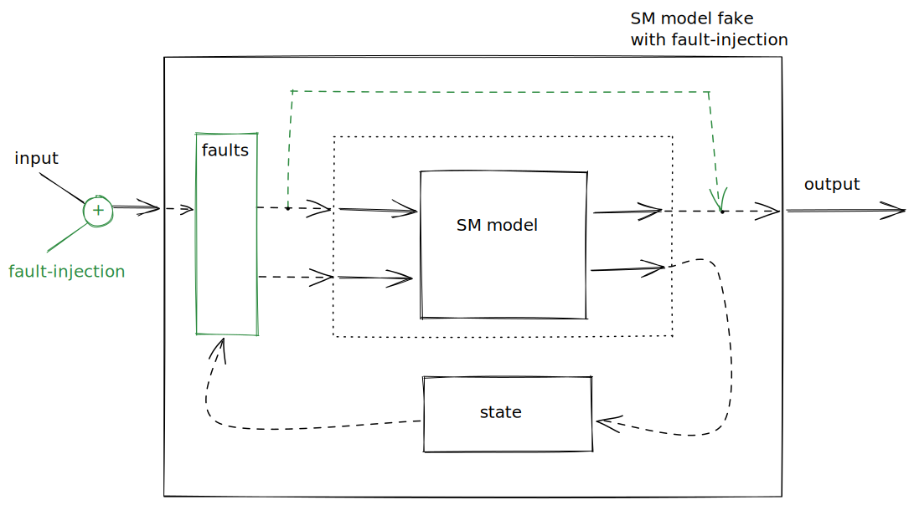
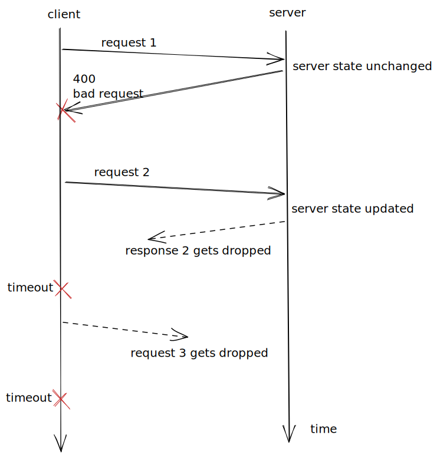
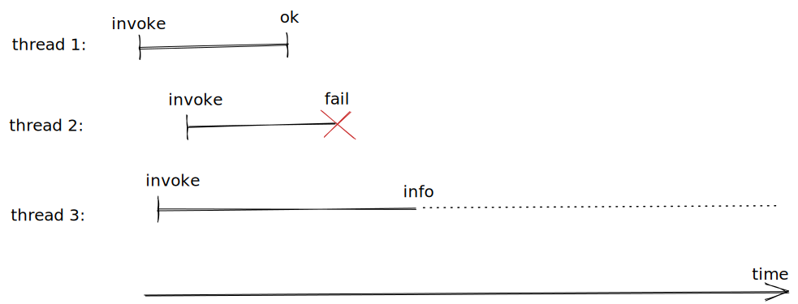

# Fault-injection

## Motivation

So far we’ve focused mostly on testing so called “happy paths”. That is code paths that don’t involve error handling. Nothing stops us from generating invalid inputs and make sure that the validation logic works though, but still this only triggers a limited set of “unhappy paths” that mostly can be tested in pure PBT way.

There are many other “unhappy paths” lurking especially around networking (e.g. timeouts and retry logic), but also dependencies/subcomponents failing (e.g. the queue or disk being full).

In fact [research](http://www.eecg.toronto.edu/~yuan/papers/failure_analysis_osdi14.pdf) shows that “almost all (92%) of the catastrophic system failures are the result of incorrect handling of non-fatal errors explicitly signaled in software. \[…\] in 58% of the catastrophic failures, the underlying faults could easily have been detected through simple testing of error handling code.”

Also the success of [Jepsen](https://jepsen.io/analyses), which we previously mentioned, crucially relies on being able to inject faults to trigger these “unhappy paths”.

So in this part we will have a look at how we can inject faults in order to try to get a better coverage in this area.

## Plan

Previously, in [part 3](./Part03SMContractTesting.md#readme), we showed how to create a thin wrapper around a state machine model in order to create a fake that can subsequently be used for integration testing. This wrapper is essentially merely a mutable variable that holds the state of the state machine between invocations.

We will extend this wrapper a little bit in a way that lets us enable and disable faults for that fake, for now just think of it as a flag that can be toggled and if the flag is set then return an error instead of the output that the state machine normally would have returned.

For example, we can have a flag that sets if the queue is full (even though it might not be) which will reject any writes to the queue. Similarly we can imagine being able to say that the queue is empty (even though it isn’t) which will cause reads to the queue to fail, and so on.

We will then use this fault injection mechanism to inject faults while integration testing the web server (which uses the queue) to ensure that the web server doesn’t crash when “unhappy paths” are triggered.

Also noteworty is that we don’t have to make any changes to the model to account of the possible faults, the linearisability checker does this for us behind the scenes.

## How it works

Lets have a look at how faults get injected first. Recall, from the previous part, the wrapper around the state machine model that turns it into a fake (in black):



The green part is what we need to add to support injecting faults. It’s basically a way to inject faults in addition to be able to feed it input, and a way for the box to be able to override the state machine’s output with some failure response.

It’s important to notice that there are different types of faults. Consider the three requests made by the client in the following diagram:



We see that the first request gets rejected, perhaps because it was malformed but it could also be because the server was too busy (the status code would probably been different then though). The first request doesn’t change the server state. While the second and third request gets dropped in-flight, but depending on when exactly it gets dropped the state of the server changes or not!

This is important because of how we model and check things, here’s what the linearisability checker sees:



Where thread 2 corresponds to the first request, while thread 3 corresponds to either of the last two requests. In the case of a timeout we don’t know if the server state changed or not, so we have to assume that the request that timed out is concurrent with all future requests, i.e. we need to pretend as if it might sometime in the future return and say `ok` or `fail`.

The nice thing is that the linearisability checker can do this bookkeeping so we don’t have to make any changes to our model. We will have to extend the linearisability checker from part 2 first though.

## Code

<!---

> {-# LANGUAGE OverloadedStrings #-}
> {-# LANGUAGE NumericUnderscores #-}
> {-# LANGUAGE ScopedTypeVariables #-}
> {-# LANGUAGE DerivingStrategies #-}

> module Part04FaultInjection
>   ( module Part04FaultInjection
>   , module Part03.ServiceTest
>   , module Test.QuickCheck
>   )
>   where

> import Control.Monad (replicateM_)
> import Control.Concurrent (threadDelay, myThreadId)
> import Control.Concurrent.Async (mapConcurrently)
> import Control.Concurrent.STM (TQueue, atomically, flushTQueue, newTQueueIO)
> import Data.Vector (Vector)
> import qualified Data.Vector as Vector
> import Data.ByteString.Lazy (ByteString)
> import qualified Data.ByteString.Lazy as LBS
> import Control.Exception
> import Control.Monad.IO.Class (MonadIO, liftIO)
> import Data.IORef
> import Data.List (permutations)
> import Test.HUnit (Assertion, assertBool)
> import Test.QuickCheck hiding (Result)
> import Test.QuickCheck.Monadic hiding (assert)
> import Network.HTTP.Types (status503)
> import Network.HTTP.Client (HttpException(HttpExceptionRequest),
>                             HttpExceptionContent(StatusCodeException), Manager,
>                             defaultManagerSettings, newManager, responseStatus,
>                             managerResponseTimeout, responseTimeoutMicro)

-->

We have to [generalise](../src/Part04/LineariseWithFault.hs) the notion of histories and linearisability from the second part to deal with faults, but otherwise the idea is the same.

``` haskell
import Part02ConcurrentSMTesting (assertWithFail, classifyCommandsLength, toPid)
import Part03.Service (Bug(..), withService, mAX_QUEUE_SIZE, fakeQueue, realQueue)
import Part03.QueueInterface
import Part03.ServiceTest (Index(Index), httpWrite, httpRead, httpReset)
import Part04.LineariseWithFault (History'(History), Operation'(..), FailureMode(..), interleavings,
                                 linearisable, prettyHistory, appendHistory)
```

A queue which supports fault-injection is merely a queue and a mutable variable that might contain a fault.

``` haskell
data FaultyFakeQueue a = FaultyFakeQueue
  { ffqQueue :: QueueI a
  , ffqFault :: IORef (Maybe Fault)
  }
```

The possible faults that we support are that the queue is full (write fails), that its empty (read fails), read throwing an exception (due to some implementation bug perhaps), and slow read (simulating a GC or I/O pause).

``` haskell
data Fault = Full | Empty | ReadFail IOException | ReadSlow
  deriving stock Show
```

We can now create a wrapper around our fake queue which inserts the right failure points depending which fault is injected. Note that a fault is only active in until it’s triggered.

``` haskell
faultyFakeQueue :: Int -> IO (FaultyFakeQueue a)
faultyFakeQueue size = do
  fake <- fakeQueue size
  ref  <- newIORef Nothing
  return FaultyFakeQueue
    { ffqQueue = QueueI
        { qiEnqueue = enqueue fake ref
        , qiDequeue = dequeue fake ref
        }
    , ffqFault = ref
    }
  where
    enqueue :: QueueI a -> IORef (Maybe Fault) -> a -> IO Bool
    enqueue fake ref x = do
      fault <- readIORef ref
      case fault of
        Just Full -> do
          removeFault ref
          return False
        _otherwise -> qiEnqueue fake x
```

``` haskell
    dequeue :: QueueI a -> IORef (Maybe Fault) -> IO (Maybe a)
    dequeue fake ref = do
      fault <- readIORef ref
      case fault of
        Just Empty -> do
          removeFault ref
          return Nothing
        Just (ReadFail err) -> do
          removeFault ref
          throwIO err
        Just ReadSlow -> do
          removeFault ref
          threadDelay 200_000 -- 0.2s
          qiDequeue fake
        _otherwise -> qiDequeue fake
```

To make it a bit easier to work with fault-injection we introduce the following helper functions.

``` haskell
injectFullFault :: IORef (Maybe Fault) -> IO ()
injectFullFault ref = writeIORef ref (Just Full)
```

``` haskell
injectEmptyFault :: IORef (Maybe Fault) -> IO ()
injectEmptyFault ref = writeIORef ref (Just Empty)
```

``` haskell
injectReadFailFault :: IORef (Maybe Fault) -> IOException -> IO ()
injectReadFailFault ref err = writeIORef ref (Just (ReadFail err))
```

``` haskell
injectReadSlowFault :: IORef (Maybe Fault) -> IO ()
injectReadSlowFault ref = writeIORef ref (Just ReadSlow)
```

``` haskell
removeFault :: IORef (Maybe Fault) -> IO ()
removeFault ref = writeIORef ref Nothing
```

The following unit test should give an idea of how the fake queue with support for fault-injection works.

``` haskell
test_injectFullFault :: Assertion
test_injectFullFault = do
  ffq <- faultyFakeQueue 4
  res1 <- qiEnqueue (ffqQueue ffq) ("test1" :: String)
  assert (res1 == True) (return ())
  injectFullFault (ffqFault ffq)
  res2 <- qiEnqueue (ffqQueue ffq) "test2"
  assert (res2 == False) (return ())
```

## Sequential integration testing

The notion of program needs to be generalised to include fault-injection, but otherwise it should look familiar.

``` haskell
newtype Program = Program { unProgram :: [Command] }
  deriving stock Show
```

``` haskell
data Command
  = ClientRequest ClientRequest
  | InjectFault Fault
  | Reset -- Used for testing only.
  deriving stock Show
```

``` haskell
data ClientRequest = WriteReq ByteString | ReadReq Index
  deriving stock Show
```

``` haskell
data ClientResponse = WriteResp Index | ReadResp ByteString
  deriving stock (Eq, Show)
```

The model is the same as for the web service from last part.

``` haskell
type Model = Vector ByteString
```

``` haskell
initModel :: Model
initModel = Vector.empty
```

Generating and shrinking programs is the same as well, modulo fault-injection.

``` haskell
forallPrograms :: (Program -> Property) -> Property
forallPrograms p =
  forAllShrink (genProgram initModel) shrinkProgram p
```

``` haskell
genProgram :: Model -> Gen Program
genProgram m0 = sized (go m0 [])
  where
    go _m cmds 0 = return (Program (reverse cmds))
    go  m cmds n = do
      cmd <- genCommand m
      let m' = fst (step m cmd)
      go m' (cmd : cmds) (n - 1)
```

``` haskell
genCommand :: Model -> Gen Command
genCommand m0 = frequency [ (1, InjectFault <$> genFault)
                          , (9, ClientRequest <$> genRequest m0)
                          ]
  where
    genRequest :: Model -> Gen ClientRequest
    genRequest m | len == 0  = WriteReq <$> (LBS.pack <$> arbitrary)
                 | otherwise = frequency
                     [ (2, WriteReq <$> (LBS.pack <$> arbitrary))
                     , (8, ReadReq  <$> (Index <$> elements [0 .. len - 1]))
                     ]
      where
        len = Vector.length m
```

``` haskell
    genFault :: Gen Fault
    genFault = frequency [ (1, pure Full)
                         , (1, pure Empty)
                         , (1, pure (ReadFail (userError "read threw exception")))
                         , (1, pure ReadSlow)
                         ]
```

``` haskell
shrinkProgram :: Program -> [Program]
shrinkProgram (Program cmds) = filter (isValidProgram initModel) ((map Program (shrinkList shrinkCommand cmds)))
  where
    shrinkCommand _cmd = []
```

``` haskell
isValidProgram :: Model -> Program -> Bool
isValidProgram _m (Program _cmds) = True
```

Stepping the model is slightly different in that the injecting faults command don’t give a client response.

``` haskell
step :: Model -> Command -> (Model, Maybe ClientResponse)
step m cmd = case cmd of
  ClientRequest (WriteReq bs) ->
    ( Vector.snoc m bs
    , Just (WriteResp (Index (Vector.length m)))
    )
  ClientRequest (ReadReq (Index ix)) ->
    ( m
    , ReadResp <$> m Vector.!? ix
    )
  InjectFault _fault -> (m, Nothing)
  Reset              -> (initModel, Nothing)
```

Likewise executing commands against the real SUT is different in the same way, but also because we need to deal with the different failure modes that result from the possilbe faults being injected.

``` haskell
data Result a = ROk a | RFail | RInfo | RNemesis
  deriving stock Show
```

``` haskell
exec :: Command -> IORef (Maybe Fault) -> Manager -> IO (Result ClientResponse)
exec (ClientRequest req) _ref mgr =
  case req of
    WriteReq bs -> do
      res <- try (httpWrite mgr bs)
      case res of
        -- NOTE: 503 means the worker queue is full, so the request gets dropped, so we can treat it as a failure.
        Left (err :: HttpException) | is503 err -> return RFail
                                    | otherwise -> return RInfo
        Right ix -> return (ROk (WriteResp ix))
    ReadReq ix  -> do
      res <- try (httpRead mgr ix)
      case res of
        -- NOTE: since read doesn't change the state we can always treat is a failure.
        Left (_err :: HttpException) -> return RFail
        Right bs -> return (ROk (ReadResp bs))
    where
      is503 :: HttpException -> Bool
      is503 (HttpExceptionRequest _req (StatusCodeException resp _bs)) = responseStatus resp == status503
      is503 _otherwise = False
exec (InjectFault fault)  ref _mgr = do
  case fault of
    Full         -> injectFullFault ref
    Empty        -> injectEmptyFault ref
    ReadFail err -> injectReadFailFault ref err
    ReadSlow     -> injectReadSlowFault ref
  return RNemesis
exec Reset _ref mgr = do
  httpReset mgr
  return RNemesis
```

But otherwise the sequential property should look familiar.

``` haskell
prop_seqIntegrationTests :: IORef (Maybe Fault) -> Manager -> Property
prop_seqIntegrationTests ref mgr = forallPrograms $ \prog -> monadicIO $ do
  r <- runProgram ref mgr initModel prog
  run (removeFault ref)
  run (httpReset mgr)
  case r of
    Left err -> do
      monitor (counterexample err)
      return False
    Right () -> return True
```

The only difference is in the run program function which needs to take the failure modes into account.

``` haskell
runProgram :: MonadIO m => IORef (Maybe Fault) -> Manager -> Model -> Program -> m (Either String ())
runProgram ref mgr m0 (Program cmds0) = go m0 cmds0
  where
    go _m []           = return (Right ())
    go  m (cmd : cmds) = do
      res <- liftIO (exec cmd ref mgr)
      case res of
        ROk resp -> do
          let (m', mResp') = step m cmd
          case mResp' of
            Just resp' | resp == resp' -> go m' cmds
                       | otherwise     -> return (Left (concat [show resp, " /= ", show resp']))
            Nothing -> return (Left (concat [show res, " /= ", show mResp']))
        RFail -> go m cmds
        -- For more see the "Crashes" section of https://jepsen.io/consistency.
        RInfo -> return (Left "Continuing would violate the single-threaded \
                             \ constraint: processes only do one thing at a time.")
        RNemesis -> do
          let (m', mResp') = step m cmd
          case mResp' of
            Nothing     -> go m' cmds
            Just _resp' -> return (Left (concat [show res, " /= ", show mResp']))
```

Like in the previous part, the sequential and concurrent properties assume that the web service is up and running, so we will define a couple of helpers for getting the web service up and running with different queues.

Recall from the last part that in the main function of the web service we can branch on, say, a command-line flag in order to determine which queue implementation to use, e.g. the real queue for “production” deployment and the fake one with faults for a “testing” deployment.

``` haskell
withFaultyQueueService :: Bug -> (Manager -> IORef (Maybe Fault) -> IO ()) -> IO ()
withFaultyQueueService bug io = do
  queue <- faultyFakeQueue mAX_QUEUE_SIZE
  mgr   <- newManager defaultManagerSettings
             { managerResponseTimeout = responseTimeoutMicro (10_000_000) } -- 10s
  withService bug (ffqQueue queue) (io mgr (ffqFault queue))
```

``` haskell
withRealQueueService :: (Manager -> IO ()) -> IO ()
withRealQueueService io = do
  queue <- realQueue mAX_QUEUE_SIZE
  mgr   <- newManager defaultManagerSettings
  withService NoBug queue (io mgr)
```

Finally we can write our sequential integratin tests with a fake and possibly faulty queue.

``` haskell
unit_seqIntegrationTests :: Bug -> IO ()
unit_seqIntegrationTests bug =
  withFaultyQueueService bug (\mgr ref -> quickCheck (prop_seqIntegrationTests ref mgr))
```

Regression tests can be added similarly to before.

``` haskell
assertProgram :: Bug -> String -> Program -> Assertion
assertProgram bug msg prog =
  withFaultyQueueService bug $ \mgr ref -> do
    let m = initModel
    r <- runProgram ref mgr m prog
    assertBool msg (isRight r)
  where
    isRight Right {} = True
    isRight Left  {} = False
```

## Concurrent integration testing

Generating and shrinking concurrent programs is same as before.

``` haskell
newtype ConcProgram = ConcProgram { unConcProgram :: [[Command]] }
  deriving stock Show
```

``` haskell
forAllConcProgram :: (ConcProgram -> Property) -> Property
forAllConcProgram k =
  forAllShrinkShow (genConcProgram initModel) (shrinkConcProgram initModel)
                   prettyConcProgram k
  where
```

``` haskell
    genConcProgram :: Model -> Gen ConcProgram
    genConcProgram m0 = sized (go m0 [])
      where
        go :: Model -> [[Command]] -> Int -> Gen ConcProgram
        go m acc sz | sz <= 0   = return (ConcProgram (reverse acc))
                    | otherwise = do
                        n <- chooseInt (2, 3)
                        cmds <- vectorOf n (genCommand m) `suchThat` concSafe m
                        go (advanceModel m cmds) (cmds : acc) (sz - n)
```

``` haskell
    advanceModel :: Model -> [Command] -> Model
    advanceModel m cmds = foldl (\ih cmd -> fst (step ih cmd)) m cmds
```

``` haskell
    concSafe :: Model -> [Command] -> Bool
    concSafe m = all (isValidProgram m . Program) . permutations
```

``` haskell
    validConcProgram :: Model -> ConcProgram -> Bool
    validConcProgram m0 (ConcProgram cmdss0) = go m0 True cmdss0
      where
        go :: Model -> Bool -> [[Command]] -> Bool
        go _m False _              = False
        go _m acc   []             = acc
        go  m _acc  (cmds : cmdss) = go (advanceModel m cmds) (concSafe m cmds) cmdss
```

``` haskell
    shrinkConcProgram :: Model -> ConcProgram -> [ConcProgram]
    shrinkConcProgram m
      = filter (validConcProgram m)
      . map ConcProgram
      . filter (not . null)
      . shrinkList (shrinkList shrinkCommand)
      . unConcProgram
      where
        shrinkCommand _cmd = []
```

``` haskell
    prettyConcProgram :: ConcProgram -> String
    prettyConcProgram = show
```

Executing commands concurrent is also same as before, except histories are richer as they need to contain the failure modes.

``` haskell
type Operation = Operation' Command (Maybe ClientResponse)
```

``` haskell
concExec :: IORef (Maybe Fault) -> Manager -> TQueue Operation -> Command -> IO ()
concExec ref mgr hist cmd = do
  pid <- toPid <$> myThreadId -- XXX: we can't reuse crashed pids...
  appendHistory hist (Invoke pid cmd)
  res <- exec cmd ref mgr
  case res of
    ROk resp -> appendHistory hist (Ok pid (Just resp))
    RFail    -> appendHistory hist (Fail pid FAIL Nothing)
    RInfo    -> appendHistory hist (Fail pid INFO Nothing)
    RNemesis -> appendHistory hist (Ok pid Nothing)
```

The concurrent property should look familiar as well.

``` haskell
-- NOTE: Assumes that the service is running.
prop_concIntegrationTests :: IORef (Maybe Fault) -> Manager -> Property
prop_concIntegrationTests ref mgr = mapSize (min 20) $
  forAllConcProgram $ \(ConcProgram cmdss) -> monadicIO $ do
    monitor (classifyCommandsLength (concat cmdss))
    monitor (tabulate "Client requests" (map constructorString (concat cmdss)))
    monitor (tabulate "Number of concurrent client requests" (map (show . length) cmdss))
    -- Rerun a couple of times, to avoid being lucky with the interleavings.
    replicateM_ 10 $ do
      history <- run newTQueueIO
      run (mapM_ (mapConcurrently (concExec ref mgr history)) cmdss)
      hist <- History <$> run (atomically (flushTQueue history))
      assertWithFail (linearisable step initModel (interleavings hist)) (prettyHistory hist)
      run (removeFault ref)
      run (httpReset mgr)
  where
    constructorString :: Command -> String
    constructorString (ClientRequest WriteReq {}) = "WriteReq"
    constructorString (ClientRequest ReadReq  {}) = "ReadReq"
    constructorString (InjectFault Full)          = "Full"
    constructorString (InjectFault Empty)         = "Empty"
    constructorString (InjectFault ReadFail {})   = "ReadFail"
    constructorString (InjectFault ReadSlow {})   = "ReadSlow"
    constructorString Reset                       = "Reset"
```

And again, because the property assumes that the web service is running, so we stand the service up first.

``` haskell
unit_concIntegrationTests :: Bug -> IO ()
unit_concIntegrationTests bug = do
  -- NOTE: fake queue is used here, justified by previous contract testing.
  ffq <- faultyFakeQueue mAX_QUEUE_SIZE
  mgr <- newManager defaultManagerSettings
  withService bug (ffqQueue ffq) (quickCheck (prop_concIntegrationTests (ffqFault ffq) mgr))
```

## Demo script

Recall the `Full` fault that causes writes to the queue to fail even though there’s capacity left in the queue. `IgnoreCheckingIfEnqueueSucceeded` introduces a bug related to not checking if writes to the queue succeeds (in `Part03.Service.httpFrontEnd`):

      > unit_seqIntegrationTests IgnoreCheckingIfEnqueueSucceeded
      *** Failed! Falsified (after 17 tests and 3 shrinks):
      Program {unProgram = [InjectFault Full,ClientRequest (WriteReq "foo")]}

`ReadFail` injects a fault that makes reading from the queue throw an error, `DontCatchDequeueError` introduces a bug where that failure isn’t caught (in `Part03.Service.worker`):

      > unit_seqIntegrationTests DontCatchDequeueError
      *** Exception: ExceptionInLinkedThread (ThreadId 653) user error (read threw exception)

The `SlowRead` fault introduces a sleep when reading from the queue, if our web services has a too short worker timeout then we might timeout that client request just because the read was a bit slow `TooShortWorkerTimeout` introduces that bug (in `Part03.Service.httpFrontend`):

      unit_seqIntegrationTests TooShortWorkerTimeout
      *** Failed! Falsified (after 9 tests and 3 shrinks):
      Program {unProgram = [InjectFault ReadSlow,ClientRequest (WriteReq "foo")]}

      > unit_concIntegrationTests NoBug

## Discussion

-   Q: Can we not just inject real faults like Jepsen does? [`iptables`](https://linux.die.net/man/8/iptables) for dropping messages and network partitions, [`tc`](https://man7.org/linux/man-pages/man8/tc.8.html) for creating latency or simulating a slow connection on the network, [`(p)kill`](https://linux.die.net/man/1/kill) for killing processes, `kill   -STOP $pid` and `kill -CONT $pid` for pausing and resuming processes to simulate long I/O or GC pauses, [`libfaketime`](https://github.com/wolfcw/libfaketime) for clock-skews, etc?

    A: We could, after all Jepsen is a very successful at finding bugs in distributed databases using these techniques. However keep in mind exactly how Jepsen is used: typically companies hire Kyle Kingsbury for a couple of weeks/months, he writes the tests and runs them, analyses the results and writes a report. Presumably while he is writing this report he runs the tests many times, getting many false positivies and flaky test runs, but since doing this analysis is his main focus he can filter out the signal from the noise. If you wanna run these tests in CI however all this noise will cause a lot of context switches and pretty fast get annoying.

    Other downsides include:

    -   Many of the above fault-injections requires root access, or they need to be done in containers or a VM which slows things down and complicates start up;
    -   Imprecise (e.g. `iptables` can’t drop exactly the 42nd message and only if it’s a read);
    -   Non-deterministic (failing test cases cannot always be reproduced reliably);
    -   No shrinking (i.e. no minimal counterexamples);
    -   Slow (we need to wait for timeouts to happend, say, \~30-90 secs);
    -   CI flakiness (e.g. transient errors due to starting up the system, `docker     pull` failing, etc).

-   Q: What about [Chaos engineering](https://en.wikipedia.org/wiki/Chaos_engineering)?

    A: Chaos engineering has the same downsides as Jepsen when it comes to being slow and non-deterministic.

    It’s important to remember in which context it was developed: Netflix (hundreds(?) of already designed and deployed systems spanning datacentres around the globe), unless you are in that same situation then the fault injection techniques discussed here are far simpler to implement.

    Works at a different level, e.g. “over 5% of the traffic receives 500 errors”, rather than “assertion A failed at line number L”, i.e. test failures will pin-point you much more precisely to where the problem is.

    It tests production configurations, as well as monitoring and alerting.

    In conclusion: chaos engineering is complementary to what we discribed here, but probably less bang for the buck and should be done later – remember the quote from the motivation: “\[…\] in 58% of the catastrophic failures, the underlying faults could easily have been detected through simple testing of error handling code.”.

-   Note: It can be tempting to modelling the faults, this moves some non-determinism out from linearisability checker into the model. This is possible, but based from our experience not recommended as it complicated the model.

## Exercises

0.  Try to imagine how much more difficult it would be to write these tests without injecting the faults in the fake, but rather the real dependency.

1.  All our faults are in the dependency, i.e. the queue, what if we wanted to inject a fault at the web service level?

2.  If our faults are completely deterministic, can we avoid `info`s in the linearisability checker altogether?

3.  The concurrent property doesn’t reveal any bugs that the sequential property already doesn’t catch, can you think of a way of introducing a bug in the SUT which only the concurrent tests can catch? If not, can you think of a way of extending/writing a different the SUT to enable this? (Hint: think about what kind of SUT Jepsen is pointed at.)

## Problems

There are many things related to fault injection that we don’t know how to do best, here are some of them.

0.  Can we do better than randomly inserting faults? (Hint: see [*Lineage-driven Fault Injection*](https://people.ucsc.edu/~palvaro/molly.pdf) by Alvaro et al (2015) and the [`ldfi`](https://github.com/stevana/detsys-testkit/tree/main/src/ldfi) directory in the `detsys-testkit` repo)

1.  Faults in the real world are often correlated with each other, i.e. if one thing fails it’s likely it will overload some other thing making it more likely to fail and so on, how can we simulate this in a good way?

2.  There’re multiple other design decisions around faults that can be explored, e.g. should faults be baked into `Command` like we did above or should they be separate from the commands, i.e. something like this `Program = Program    [Fault] [Command]`? Should faults be one-shots like we did above, or should they have a “fault off” command? Or should they be time based, i.e. “this fault is active between t0 and t1”?

3.  What’s better at finding bugs: i) a small fixed agenda and try many faults and interleavings, or ii) a big random agenda and fewer interleavings?

4.  Can we contract test the fault injection? I.e. how do we know that the faults we inject correspond to real faults that can happen? How can we be sure to have covered all possible real faults?

    To answer questions of this kind it helps to specify fault models, for an example of this see `tigerbeetle`’s [documentation](https://github.com/coilhq/tigerbeetle/blob/main/docs/DESIGN.md#fault-models), one then manually needs to convince oneself of the fact that the fault models are covered by the fault injection.

## See also

-   The research paper we mentioned in the motivation section: [Simple Testing Can Prevent Most Critical Failures: An Analysis of Production Failures in Distributed Data-intensive Systems](http://www.eecg.toronto.edu/~yuan/papers/failure_analysis_osdi14.pdf) (2014) Yuan et al.;

-   [*Why Is Random Testing Effective for Partition Tolerance Bugs?*](https://dl.acm.org/doi/pdf/10.1145/3158134) by Majumdar and Niksic (2018) explains why Jepsen is so effective at finding bugs;

-   The [`failpoint`](https://github.com/pingcap/failpoint) Go library allows us to insert failures at any point in our code, in some way this is a cheap-and-dirty way of achiving the same thing as we’ve done in this part. Cheap because it’s less work, dirty because it litters the (production) code with fail points (our fail points are hidden in the fake);

-   Erlang’s “let it crash” philosopy (see p. 107 in Joe Armstrong’s [thesis](http://www.diva-portal.org/smash/record.jsf?pid=diva2%3A9492&dswid=1026)) and their [supervisor trees](https://learnyousomeerlang.com/supervisors);

-   Richard Cook’s talk [“How Complex Systems Fail”](https://www.youtube.com/watch?v=2S0k12uZR14) (2012) and his [summary](https://how.complexsystems.fail/);

-   [Nancy Leveson](http://sunnyday.mit.edu/)’s work on [STAMP](https://stamp-consulting.com/what-is-stamp/) and her book [“Engineering a Safer World: Systems Thinking Applied to Safety”](https://direct.mit.edu/books/book/2908/Engineering-a-Safer-WorldSystems-Thinking-Applied) (2012);

-   [Resilience engineering](https://en.wikipedia.org/wiki/Resilience_engineering);

-   [Complex systems](https://en.wikipedia.org/wiki/Complex_system), in particular Dave Snowden’s [work](https://www.youtube.com/watch?v=l4-vpegxYPg).

## Summary

-   Most catastrophic system failures are related to error handling, fault-injection allows us to trigger error handling code and therefore increase our coverage to catch these failures before they happen in production;

-   Fault-injection is much easier to do deterministically when using fakes.

## Next up

Finally in [part 5](./Part05SimulationTesting.md#readme), we will look at how we can simulate the running of a whole network of nodes using fakes and ensure that properties hold while injecting faults into the network. By doing so we can achieve fast and deterministic end-to-end test of distributed systems.
